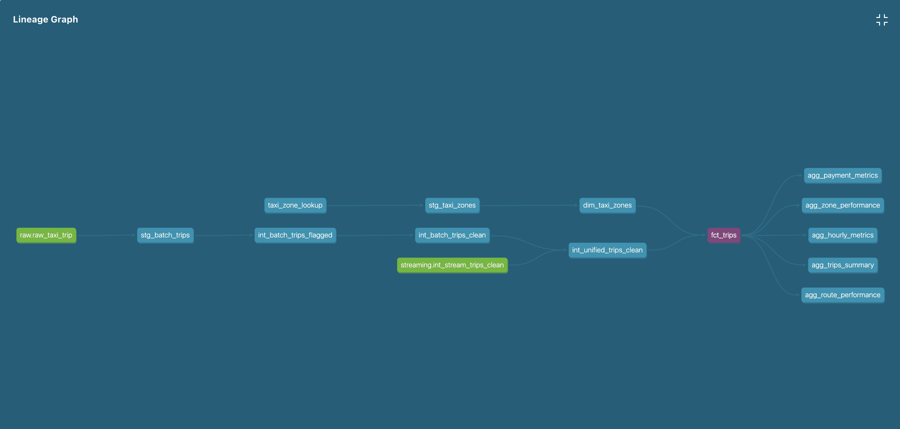

# Cloud Data Pipeline — Batch and Streaming Processing

An end-to-end hybrid data platform using a Lambda Architecture to integrate historical transaction data (batch) and real-time transaction events (streaming) into a single data warehouse.

The platform covers the full data lifecycle, from raw ingestion, cleaning, and validation to structured transformations and analytical data marts.

---

## Architecture


---

## Data Source Information

| Category            | Parameter          | Details                                                        |
| ------------------- | ------------------ | -------------------------------------------------------------- |
| **Batch Data**      | Dataset            | NYC Green Taxi Trip Records                                    |
|                     | Processing Period  | April – May 2026                                               |
|                     | Source Format      | Parquet (trips) + CSV (static zone lookup)                     |
| **Streaming Data**  | Event Type         | Real-time trip transactions (JSON)                             |
|                     | Event Generator    | Python publisher based on statistical patterns from batch data |
|                     | Target Period      | June – July 2026                                               |

---

## Technology Stack

| Category                 | Technology                         |
| ------------------------ | ---------------------------------- |
| Programming Language     | Python                             |
| Data Orchestration       | Apache Airflow                     |
| Data Transformation      | dbt                                |
| Data Warehouse           | Google BigQuery                    |
| Cloud Storage            | Google Cloud Storage               |
| Message Broker           | Google Cloud Pub/Sub               |
| Streaming Processing     | Apache Beam (Dataflow Runner)      |
| Containerization         | Docker & Docker Compose            |
| Infrastructure as Code   | Terraform                          |
| CI/CD                    | GitHub Actions                     |

---

## Project Structure

```text
cloud-data-pipeline/
├── .github/workflows/           # CI/CD pipelines (dbt, streaming, DAG, terraform)
├── airflow/
│   ├── dags/                    # Airflow DAGs
│   ├── logs/
│   └── plugins/
├── dbt/                         # dbt models, seeds, macros, and tests
├── docs/images/                 # Architecture diagram and execution screenshots
├── infra/terraform/             # Infrastructure as Code (GCS, BigQuery, Pub/Sub)
├── notebook/                    # EDA notebook
├── src/
│   ├── batch/                   # Raw data ingestion and profiling
│   ├── config/                  # Settings (Pydantic) and static constants
│   ├── core/                    # Shared validation, transformation, and schema logic
│   ├── observability/           # Logging and pipeline run tracking
│   └── streaming/               # Beam pipeline, event generator, publisher
├── tests/
│   ├── beam/                    # Apache Beam pipeline tests
│   ├── dags/                    # Airflow DAG tests
│   └── unit/                    # Unit tests for core and streaming logic
├── Dockerfile
├── docker-compose.yml
├── requirements.txt             # Airflow image dependencies (batch + dbt)
├── requirements-dbt.txt         # Minimal dbt dependencies, used by CI
├── requirements-test.txt        # Test dependencies (pytest, pydantic-settings, etc.)
├── requirements-build.txt       # Build tooling for packaging the streaming job
├── setup.py                     # Packaging config for Dataflow deployment
└── README.md
```

---

## Assumptions

- The batch pipeline is designed to be safely re-run for the same `reporting_year_month` without creating duplicate records.
- The taxi zone lookup data is treated as static reference data and is managed separately as a dbt seed, not through the batch ingestion flow.
- Streaming events for June–July 2026 are simulated based on statistical patterns observed in the April–May batch data.
- Each streaming event has a unique `event_id`.
- Batch and streaming data are expected to follow the same core data quality rules.

---

## Setup & Configuration

### Prerequisites

- Docker & Docker Compose
- Python 3.11 and a virtual environment (`.venv`)
- `gcloud` CLI, authenticated to your own GCP project
- A GCP service account with BigQuery, GCS, and Pub/Sub access

### Steps

1. **Clone the repository**
```bash
git clone https://github.com/agungngrh/cloud-data-pipeline.git
cd cloud-data-pipeline
```

2. **Set up your environment file**
```bash
cp .env.example .env
```
Fill in `.env` with your own values, including your GCP project ID, region, bucket name, BigQuery dataset names, and Pub/Sub topic and subscription names. Configuration is loaded and validated through `src/config/settings.py` using Pydantic Settings, so a missing required variable will raise a clear error at startup instead of failing silently later.

3. **Install Python dependencies**
```bash
python3 -m venv .venv
source .venv/bin/activate        # macOS/Linux
.venv\Scripts\activate           # Windows

pip install -r requirements.txt
```
For running the test suite or building the streaming package locally, also install:
```bash
pip install -r requirements-test.txt      # for running pytest
```

4. **Authenticate to your GCP account**
```bash
gcloud auth login
gcloud config set project <your-gcp-project-id>
gcloud auth application-default login
```

5. **Provision the GCP infrastructure with Terraform**

Terraform manages the GCP infrastructure required by the pipeline, including the GCS bucket, BigQuery datasets and tables, and the Pub/Sub topic, subscription, and schema.
```bash
cd infra/terraform
terraform init
terraform plan
terraform apply
cd ../..
```
Infrastructure changes are also applied automatically through the `cd-terraform.yml` workflow whenever changes under `infra/terraform/` are pushed to `main`.

6. **Ingest the raw datasets**

The ingestion script downloads each configured dataset to the local `data/raw/` directory, then uploads it to the `raw/` prefix in the Terraform-managed GCS bucket. The process is idempotent: existing local files are reused, and files that already exist in GCS are not uploaded again.
```bash
python3 -m src.batch.download_upload_raw
```

7. **Set up the dbt seed**

`taxi_zone_lookup.csv` is a static reference dataset managed as a dbt seed. Copy it from GCS into the dbt seeds directory:
```bash
gsutil cp gs://<your-bucket>/raw/taxi_zone_lookup.csv dbt/seeds/taxi_zone_lookup.csv
```
Load the seed into BigQuery:
```bash
cd dbt
dbt seed --select taxi_zone_lookup
cd ..
```
This is a one-time step; the seed is not reloaded by the monthly Airflow batch pipeline.

8. **Start Airflow locally**
```bash
docker compose up -d airflow-init
docker compose up -d
```

---

## Running the Batch Pipeline

The batch pipeline is fully orchestrated by Airflow.

- **DAG ID:** `agungnugraha_batch_trip_pipeline`
- **Schedule:** `@monthly`, backfilled for `2026-04-01` → `2026-05-31`
- **Flow:** `ingestion_layer` → `staging_layer` → `intermediate_layer` → `marts_layer`

The static `taxi_zone_lookup` reference data is managed separately through a dbt seed and is not loaded by this DAG.

Each dbt layer runs `dbt run` followed by `dbt test`, using `reporting_year_month` derived from the DAG's `data_interval_start`.

After starting Airflow, open `http://localhost:8085` and unpause the DAG.

---

## Running the Streaming Pipeline

### 1. Profiling

```bash
python3 -m src.batch.batch_profiling
```
Produces `data/profile/profile_output.json`. The statistical basis used by the event generator is derived from the April and May batch data, so simulated streaming events remain consistent with observed patterns rather than being purely random.

### 2. Publisher

Run in one terminal to generate and send events to Pub/Sub at a configurable rate:
```bash
python3 -m src.streaming.publisher --rate 2 --max-events 500
```
- `--rate`: events per second (default `1.0`)
- `--max-events`: optional event limit; omit to run indefinitely
- Stop safely with `Ctrl+C`

### 3. Build the deployment package

Dataflow workers run in a separate environment and need the pipeline's custom code (`src/`) packaged as a wheel. The Avro schema is copied from its Terraform source into the package before building:
```bash
pip install -r requirements-build.txt
mkdir -p src/streaming && cp infra/terraform/schemas/trip_event.avsc src/streaming/trip_event.avsc
python3 -m build
```
This produces `dist/cloud_data_pipeline-*.whl`, which the pipeline automatically picks up and attaches to the Dataflow job via `--extra_package`. This step is required before every Dataflow deployment, since the wheel must reflect the current state of `src/`.

### 4. Beam Pipeline

Run in a second terminal to read from Pub/Sub, validate events, and write them to BigQuery:
```bash
python3 -m src.streaming.pipeline --runner=DataflowRunner
```
This is the recommended way to run the pipeline, since it reflects how the job is actually deployed.

Stopping the local script with `Ctrl+C` only stops the local process; a job submitted to Dataflow keeps running in the cloud until it is cancelled from the Dataflow console or the `gcloud` CLI.

---

## Data Model

The data warehouse follows a layered structure for both batch and streaming data.

### Batch

| Layer         | Models                                                                                     | Purpose                                                     |
| -------------- | --------------------------------------------------------------------------------------------- | -------------------------------------------------------------- |
| Raw            | `raw_taxi_trip`, `taxi_zone_lookup`                                                              | Stores source data as ingested.                                   |
| Staging        | `stg_batch_trips`, `stg_taxi_zones`                                                                | Standardizes the raw trip data.                                     |
| Intermediate   | `int_batch_trips_clean`, `int_batch_trips_flagged`, `int_batch_trips_quarantine`, `int_unified_trips_clean` | Applies validation, transformation, and quarantine handling.          |
| Marts          | `fct_trips`, `dim_taxi_zones`, `agg_hourly_metrics`, `agg_payment_metrics`, `agg_route_performance`, `agg_trips_summary`, `agg_zone_performance` | Provides aggregated datasets for analytical use. |

### Streaming

| Layer         | Models                                              | Purpose                                                       |
| -------------- | ------------------------------------------------------ | ------------------------------------------------------------------ |
| Intermediate   | `int_stream_trips_clean`, `int_stream_trips_quarantine`   | Stores validated events and quarantined events processed by Beam.    |

---

## Data Quality Validation

The batch and streaming pipelines apply the same core validation rules to maintain consistent data quality across both processing paths.

### Validation Rules

- `is_complete_record` — required fields are not null.
- `is_valid_distance` — `trip_distance >= 0`.
- `is_valid_fare` — `fare_amount >= 0` and `total_amount >= 0`.
- `is_valid_passenger_count` — `passenger_count >= 1`.
- `is_valid_location` — pickup and drop-off locations are not unknown zones (`264`, `265`).
- `amount_mismatch` is calculated as an informational check by comparing `total_amount` with the recomputed fare components. It does not affect record validity.

### Quarantine Handling

Records that fail validation are not discarded. Batch failures are routed to `int_batch_trips_quarantine`, and streaming failures are routed to `int_stream_trips_quarantine` together with the specific validation failure reason for auditing.

Streaming events that fail to parse entirely (for example, malformed or corrupted payloads) are also routed to the same quarantine table rather than being dropped silently. These rows are tagged with a `PARSE_ERROR` reason and include the raw payload in a dedicated `raw_payload` column, so they remain traceable even when the event could not be decoded into individual fields.

---

## Idempotency Strategy

### Batch

- Pipeline execution is parameterized using `reporting_year_month` to define the processing period.
- Existing records for the processing period are removed before new data is loaded, allowing the same reporting period to be safely reprocessed.
- dbt incremental models use a `merge` strategy with defined unique keys to update existing records and prevent duplicates when the same records are processed again.
- Mart models are rebuilt on each run so downstream results reflect the latest processed data.

### Streaming

- Every event is assigned a unique `event_id` for identification and traceability.

---

## Observability

Every batch task and streaming run writes a record to `pipeline_run_log`, a table in the `ops` dataset dedicated to operational tracking. Each row includes the run ID, pipeline type (`BATCH` or `STREAMING`), task ID, status, start and end time, row counts (`rows_read`, `rows_written`, `rows_quarantined`), and an error message when applicable.

- For batch, this is populated by Airflow's `on_success_callback` / `on_failure_callback`, which also queries BigQuery to calculate row counts per layer for the processed `reporting_year_month`.
- For streaming, this is populated once the Beam pipeline stops, using row counts computed from `int_stream_trips_clean` and `int_stream_trips_quarantine` within the run's time window.

This table provides a single place to check whether a given run succeeded, how many rows it processed, and what failed, without having to inspect Airflow logs or the Dataflow console directly.

---

## Testing

The project includes unit and integration tests covering core validation and transformation logic, the streaming pipeline, and the Airflow DAG structure.

```bash
python3 -m pytest tests/unit -v
python3 -m pytest tests/beam -v
```

DAG tests under `tests/dags/` depend on the `apache-airflow` package and are run inside an Airflow container, consistent with the `ci-dag.yml` workflow, rather than in the local virtual environment.

---

## CI/CD

| Workflow             | Trigger                                                    | Purpose                                                        |
| --------------------- | ------------------------------------------------------------- | ------------------------------------------------------------------ |
| `ci-dbt.yml`           | Push to `dev` / PR to `main` touching `dbt/**`                   | Runs `dbt debug`, `dbt compile`, and `dbt test` against an isolated CI dataset. |
| `ci-streaming.yml`      | Push/PR touching streaming, core, observability, or config code   | Runs unit and Beam pipeline tests.                                    |
| `ci-dag.yml`             | Push/PR touching DAG or `src/**` code                              | Validates DAG structure and integrity inside an Airflow container.       |
| `cd-terraform.yml`        | Push to `main` touching `infra/terraform/**`                        | Applies infrastructure changes to GCP automatically.                       |

---

## Proof of Execution

### Batch Orchestration


Successful Airflow DAG execution.

### dbt Documentation



dbt model lineage showing the transformation flow.

### Pub/Sub Configuration


Pub/Sub topic and subscription used for the streaming pipeline.

### Event Publishing


Publisher sending events to Pub/Sub.

### Beam Processing


Beam pipeline processing streaming events.

### Batch Output


Batch records written to BigQuery mart tables.

### Streaming Output


Valid streaming events written to `int_stream_trips_clean`.

### Data Quality Results


Batch data quality validation results.

### Quarantine Records


Invalid streaming events routed to `int_stream_trips_quarantine`, with their validation failure reasons.

### Batch vs. Streaming Analysis


Batch and streaming comparison results.

---

## Future Development

- Add monitoring and alerting for pipeline health and data quality, including Dataflow job status.