# Cloud Data Pipeline — Batch and Streaming Processing

An end-to-end hybrid data platform using a Lambda Architecture to integrate historical transaction data (batch) and real-time transaction events (streaming) into a single data warehouse.

The platform covers the full data lifecycle, from raw ingestion, cleaning, and validation to structured transformations and analytical data marts, with idempotent processing to prevent duplicate data.


---


## Table of Contents

1. [System Architecture](#system-architecture)
2. [Data Source Information](#data-source-information)
3. [Technology Stack](#technology-stack)
4. [Project Structure](#project-structure)
5. [Assumptions](#assumptions)
6. [Setup & Configuration](#setup--configuration)
7. [Running the Batch Pipeline](#running-the-batch-pipeline)
8. [Running the Streaming Pipeline](#running-the-streaming-pipeline)
9. [Data Model](#data-model)
10. [Data Quality Validation](#data-quality-validation)
11. [Idempotency Strategy](#idempotency-strategy)
12. [Partitioning & Clustering](#partitioning--clustering)
13. [Analytical Queries](#analytical-queries)
14. [Proof of Execution](#proof-of-execution)
15. [Future Development](#future-development)


---

## System Architecture

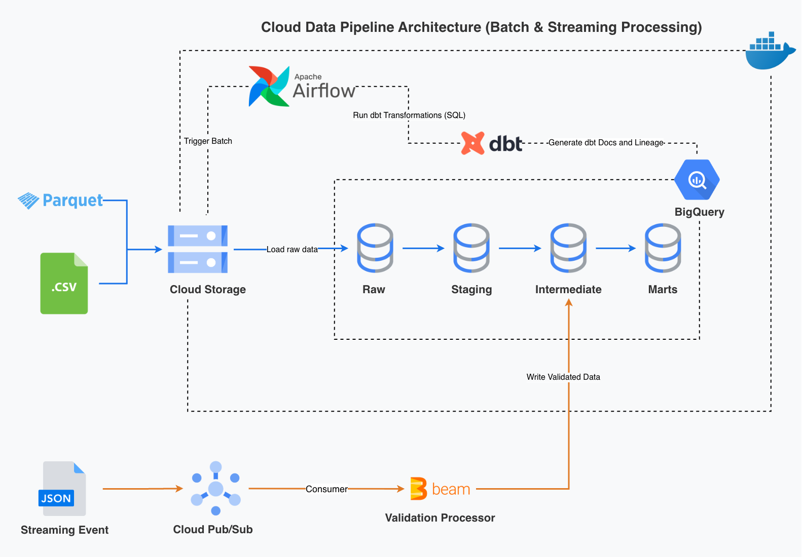

The pipeline has two independent data flows that converge at the BigQuery warehouse:

### Batch

GCS (raw Parquet) → Airflow (`GCSToBigQueryOperator`) → BigQuery `raw` → dbt (`staging` → `intermediate` → `marts`)

### Streaming

Event generator → Pub/Sub → Apache Beam (validation + transform) → BigQuery `intermediate` (clean/quarantine)


---


## Data Source Information

| Category           | Parameter         | Details                                                    |
| ------------------ | ----------------- | ---------------------------------------------------------- |
| **Batch Data**     | Dataset           | NYC Green Taxi Trip Records                                |
|                    | Processing Period | April – May 2026                                           |
|                    | Raw Records       | ~89,159 rows                                               |
|                    | Source Format     | Parquet (trips) + CSV (static zone lookup)                 |
| **Streaming Data** | Event Type        | Simulated real-time trip transactions (JSON)               |
|                    | Event Generator   | Python publisher based on patterns observed in batch data  |
|                    | Target Volume     | ~89,159 events (June – July 2026)                          |


---


## Technology Stack

| Category             | Technology                 |
| -------------------- | -------------------------- |
| Programming Language | Python 3.11                |
| Data Orchestration   | Apache Airflow 2.10.5      |
| Data Transformation  | dbt                        |
| Data Warehouse       | Google BigQuery            |
| Cloud Storage        | Google Cloud Storage       |
| Message Broker       | Google Cloud Pub/Sub       |
| Streaming Processing | Apache Beam                |
| Containerization     | Docker & Docker Compose    |


---


## Project Structure

```text
cloud-data-pipeline/
├── airflow/dags/          # Airflow DAGs
├── config/                # Project configuration
├── dbt/                   # dbt models, seeds, and analyses
├── docs/                  # Documentation and images
├── notebook/              # EDA notebooks
├── scripts/               # Batch and streaming scripts
├── utils/                 # Shared utilities
├── .env.example
├── .gitignore
├── docker-compose.yml
├── requirements.txt
└── README.md
```


---


## Assumptions

- The batch pipeline is designed to be safely re-run for the same `reporting_year_month` without creating duplicate records.
- The taxi zone lookup data is treated as static reference data and is managed separately as a dbt seed.
- Streaming events for June–July 2026 are simulated based on statistical patterns observed in the April–May batch data.
- Each streaming event is assumed to have a unique `event_id` for event identification and duplicate prevention.
- Batch and streaming data are expected to follow the same core data quality rules.


---


## Setup & Configuration

### Prerequisites

* Docker & Docker Compose
* Python 3.11 and a virtual environment (`.venv`)
* `gcloud` CLI, authenticated to your own GCP project
* A GCP service account key with BigQuery, GCS, and Pub/Sub access

### Steps

1. **Clone the repository**

   ```bash
   git clone https://github.com/agungngrh/cloud-data-pipeline.git
   cd cloud-data-pipeline
   ```

2. **Set up your environment file**

   ```bash
   cp .env.example .env
   ```

   Fill in `.env` with **your own** values — your GCP project ID, bucket name, BigQuery dataset names that include **your own** ID, and Pub/Sub topic and subscription names.

3. **Install Python dependencies**

   ```bash
   python3 -m venv .venv
   source .venv/bin/activate
   pip install -r requirements.txt
   ```

4. **Authenticate to your own GCP account**

   ```bash
   gcloud auth login
   gcloud config set project <your-gcp-project-id>
   gcloud auth application-default login
   ```

5. **Provision your own GCP infrastructure**

   ```bash
   python3 -m scripts.batch.create_bucket
   python3 -m scripts.batch.download_upload_raw
   python3 -m scripts.streaming.setup_bigquery
   gcloud pubsub topics create <your-topic-name>
   gcloud pubsub subscriptions create <your-subscription-name> --topic=<your-topic-name>
   ```

6. **Set up the dbt seed**

   The `taxi_zone_lookup.csv` file is a static reference dataset managed by dbt as a seed. Copy it from GCS into the dbt seeds directory:

   ```bash
   gsutil cp gs://<your-bucket>/raw/taxi_zone_lookup.csv dbt/seeds/taxi_zone_lookup.csv
   ```

   Load the seed into the BigQuery raw dataset:

   ```bash
   cd dbt
   dbt seed --select taxi_zone_lookup
   cd ..
   ```

   The seed is loaded once during the initial setup and is not reloaded by the monthly Airflow batch pipeline.

7. **Start Airflow locally**

   ```bash
   docker compose up -d airflow-init
   docker compose up -d
   ```


---


## Running the Batch Pipeline

The batch pipeline is fully orchestrated by Airflow.

* **DAG ID:** `agungnugraha_batch_trip_pipeline`
* **Schedule:** `@monthly`, backfilled for `2026-04-01` → `2026-05-31`
* **Flow:** `ingestion_layer` → `staging_layer` → `intermediate_layer` → `marts_layer`

The static taxi_zone_lookup reference data is managed separately through a dbt seed and is therefore not loaded by Airflow.

Each dbt layer runs `dbt run` followed by `dbt test`, parameterized by `reporting_year_month` derived from the DAG's `data_interval_start`.

After starting Airflow, open `http://localhost:8085` and **unpause the DAG**. 


---

## Running the Streaming Pipeline

### 1. EDA / Profiling

```bash
python3 -m scripts.streaming.batch_profiling
```

Produces `/data/profile/profile_output.json`. The statistical basis used by the event generator is derived from the April and May datasets, ensuring that the streaming data remains consistent with actual batch patterns rather than being purely random.

### 2. Publisher

Run in one terminal to generate and send events to Pub/Sub at a configurable rate:

```bash
python3 -m scripts.streaming.publisher --rate 2 --max-events 500
```

* `--rate`: events per second (default `1.0`)
* `--max-events`: optional event limit; omit to run indefinitely
* Stop safely with `Ctrl+C`.

### 3. Beam Pipeline

Run in a second terminal to read from Pub/Sub, validate events, and write them to BigQuery:

```bash
python3 -m scripts.streaming.pipeline
```

This mode uses `DirectRunner` by default to process events directly in the local environment.

### 4. Data Freshness & Observability

To ensure streaming pipeline SLA compliance, dbt monitors real-time ingestion latency on `stream_trips_clean`:

```bash
dbt source freshness --select source:stream_trips_clean
```

Failures usually mean upstream Pub/Sub or streaming worker issues, letting us catch delays before they hit downstream consumers.


---


## Data Model

The data warehouse follows a layered structure for both batch and streaming data.

### Batch

| Layer | Models | Purpose |
|---|---|---|
| Raw | `raw_taxi_trip`, `taxi_zone_lookup` | Stores source data as ingested from the source files. |
| Staging | `stg_taxi_trip`, `stg_taxi_zone` | Standardizes the raw trip data. |
| Intermediate | `int_trips_flagged`, `int_trips_clean`, `int_trips_enriched`, `int_quarantine_trips`, `dq_check_result` | Applies validation, transformation, join, and quarantine handling. |
| Marts | `daily_trips`, `hourly_demand`, `payment_behavior`, `route`, `zone_performance_summary`, `batch_streaming_comparison` | Provides aggregated datasets for analytical use. |

### Streaming

| Layer | Models | Purpose |
|---|---|---|
| Intermediate | `stream_trips_clean`, `stream_trips_quarantine` | Stores validated events and quarantined events processed by Beam. |


---


## Data Quality Validation

The batch and streaming pipelines apply the same core validation and transformation rules to maintain consistent data quality across both processing paths.

### Validation Rules

The following rules are applied to both batch and streaming data:

- `is_complete_record` — required fields are not null.
- `is_valid_distance` — `trip_distance >= 0`.
- `is_valid_fare` — `fare_amount >= 0` and `total_amount >= 0`.
- `is_valid_passenger_count` — `passenger_count >= 1`.
- `is_valid_location` — pickup and drop-off locations are not unknown zones (`264`, `265`).
- `amount_mismatch` is also calculated as an informational check by comparing `total_amount` with the recomputed fare components. It does not affect record validity.

### Quarantine Handling

Records that fail validation are not discarded. Batch failures are routed to `int_quarantine_trips`, while streaming failures are routed to `stream_trips_quarantine` together with the specific validation failure reason for auditing.

### Data Quality Results

The batch pipeline records validation results in `dq_check_result`, including the failed-row percentage for each rule. This provides an overview of data quality for each reporting period.


---


## Idempotency Strategy

### Batch

- Pipeline execution is parameterized using `reporting_year_month`.
- Existing records for the processing period are removed before new data is loaded to support idempotent reprocessing.
- Incremental models use a merge strategy with defined unique keys to prevent duplicates and update existing records when the same period is reprocessed, while mart models are rebuilt on each run to ensure the latest results.

### Streaming

* Every event contains a unique `event_id` for event identification.
* Invalid events are routed to the quarantine table with their validation failure reasons.
* Valid events are processed and written to the curated streaming layer.


---


## Partitioning & Clustering

### Batch

The `raw_taxi_trip` table is partitioned by `lpep_pickup_datetime` on a monthly basis. It is also clustered by `PULocationID` and `DOLocationID` because these columns are often used for filtering, grouping, and joining the data. Monthly partitioning also helps reduce the amount of data scanned when running queries for a specific period.

### Streaming

The `stream_trips_clean` and `stream_trips_quarantine` tables are partitioned by `event_time` on a daily basis. No clustering is used because the streaming data is relatively small and is mainly queried by event time. Daily partitioning helps reduce the amount of data scanned when querying a specific time period.                                         |


---


## Analytical Queries

### 1. Batch Analysis

The batch marts are used to analyze historical trip patterns, including daily and hourly demand, payment behavior, route performance, and zone performance.

### 2. Batch vs. Streaming Comparison

The `batch_streaming_comparison.sql` query compares batch and streaming data using trip count, average trip distance, average fare amount, and average total amount. This helps check whether the generated streaming data follows the patterns found in the batch data.

### 3. Data Quality Analysis

Data quality queries are used to review validation results and quarantined records. They show rule failure rates and the main reasons why streaming events were rejected.


---


## Proof of Execution

### Batch Orchestration

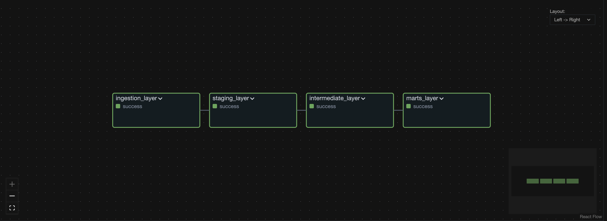

Successful Airflow DAG execution.

### dbt Documentation

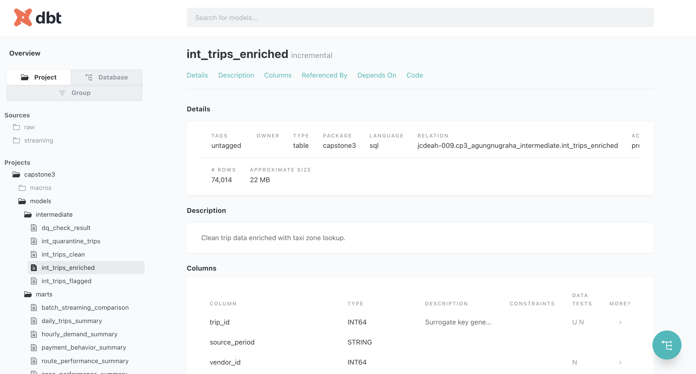

dbt documentation showing the int_trips_enriched model, including its materialization, description, columns, and data tests.

### dbt Transformation

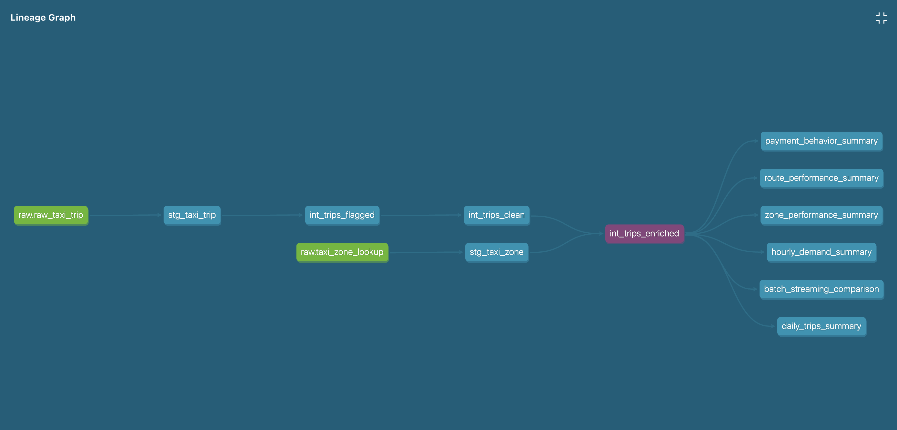

dbt model lineage showing the transformation flow.

### Pub/Sub Configuration

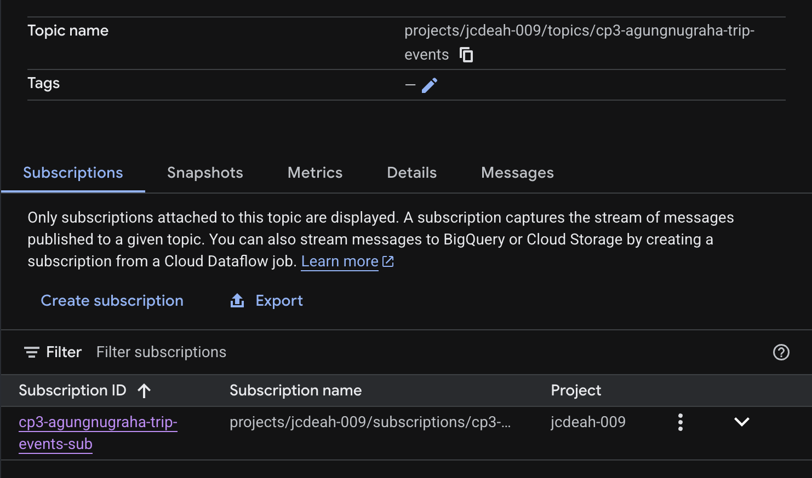

Pub/Sub topic and subscription used for the streaming pipeline.

### Event Publishing

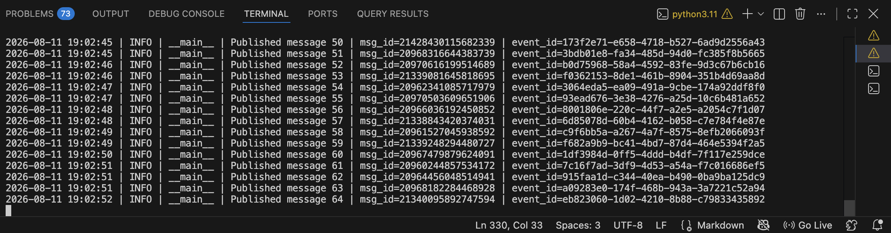

Publisher sending events to Pub/Sub.

### Beam Processing

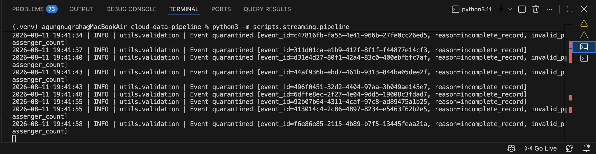

Beam pipeline processing streaming events.

### Batch Output

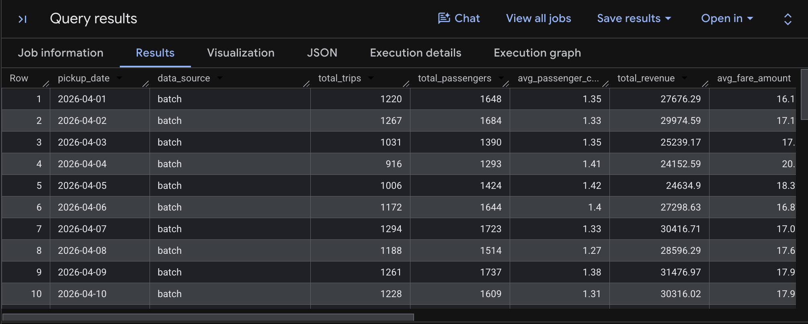

Batch records written to the daily_trips_summary table in BigQuery.

### Streaming Output

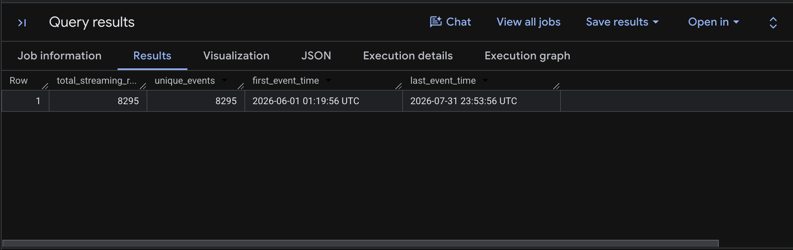

Valid streaming events written to the `stream_trips_clean` table in BigQuery.

### Data Quality Results

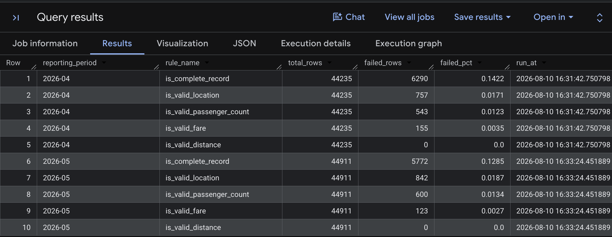

Batch data quality validation results from `dq_check_result`.

### Quarantine Records

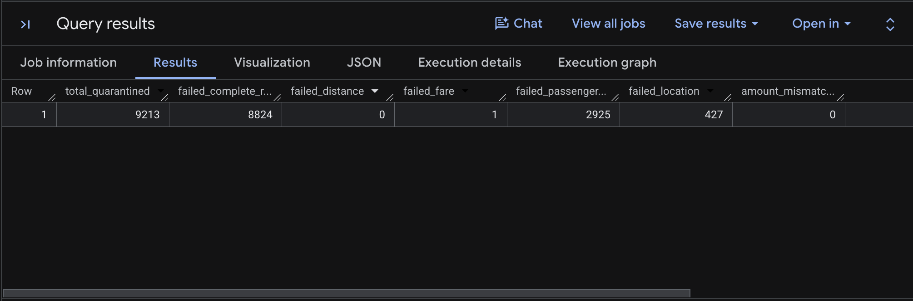

Invalid streaming events routed to `stream_trips_quarantine`, with their validation failure reasons.

### Batch vs. Streaming Analysis

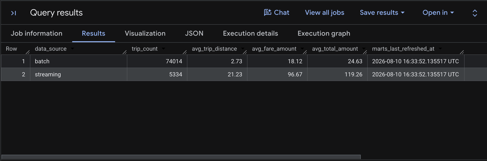

Batch and streaming comparison results.


---


## Future Development

* Run the Beam streaming pipeline on Dataflow for cloud scalability.
* Add CI/CD with GitHub Actions for automated testing and deployment.
* Add Terraform for automated GCP infrastructure provisioning.
* Add monitoring and alerting for pipeline health and data quality.

